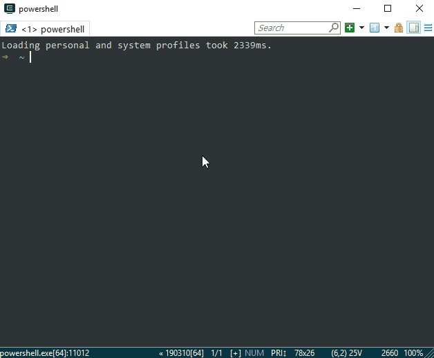

# windows-dotfiles

Uses [oh-my-posh](https://github.com/JanDeDobbeleer/oh-my-posh) and [posh-git](https://github.com/dahlbyk/posh-git) to get that sweet sweet zsh look and git integration. Powershell modules installed from `oobe/ps-modules.ps1`, then `Microsoft.PowerShell_profile.ps1` is added to `%userprofile%/Documents/WindowsPowerShell`.

Look how glorious it is!

On a fresh install, I would usually run the two `.reg` files in `oobe/` to enhance the Windows Explorer shell, and install all the programs I need through [chocolatey](http://chocolatey.org), and from `oobe/chocolatey.ps1`.

Also, I have added vim support so one can finally go `vim sourcecode.js`. Yay! 🎉 Remember to install vim, and point the alias to the correct `vim.exe` location

Might write a script to automate these things one day, still learning Powershell 👩‍💻

Most of the stuff are just taken from elsewhere, so I didn't really create these amazing tools. Kudos to the creators!

## Handy references

### Windows Environment Path Variables

More details can be found [here](https://ss64.com/nt/syntax-variables.html)

`%AllUsersProfile%` - Open the All User's Profile C:\ProgramData

`%AppData%` - Opens AppData folder C:\Users\{username}\AppData\Roaming

`%CommonProgramFiles%` - C:\Program Files\Common Files

`%CommonProgramFiles(x86)%` - C:\Program Files (x86)\Common Files

`%HomeDrive%` - Opens your home drive C:\

`%LocalAppData%` - Opens local AppData folder C:\Users\{username}\AppData\Local

`%ProgramData%` - C:\ProgramData

`%ProgramFiles%` -  C:\Program Files or C:\Program Files (x86)

`%ProgramFiles(x86)%` - C:\Program Files (x86)

`%Public%` - C:\Users\Public

`%SystemDrive%` - C:

`%SystemRoot%` - Opens Windows folder C:\Windows

`%Temp%` - Opens temporary file Folder C:\Users\{Username}\AppData\Local\Temp

`%UserProfile%` - Opens your user's profile C:\Users\{username}

`%AppData%\Microsoft\Windows\Start Menu\Programs\Startup` - Opens Windows 10 Startup location for program shortcuts
